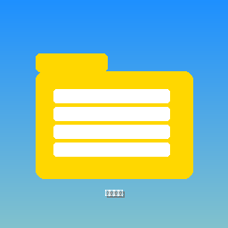

# 📁 Persian File Copier Pro v2.0 - راهنمای کامل

<div align="center">



**نرم‌افزار مدیریت و کپی فایل پیشرفته**

[](https://github.com/modir123456/anbardari)
[](https://python.org)
[](#)

</div>

---

## 📋 فهرست مطالب

- [معرفی نرم‌افزار](#-معرفی-نرمافزار)
- [ویژگی‌های کلیدی](#-ویژگیهای-کلیدی)
- [نصب و راه‌اندازی](#-نصب-و-راهاندازی)
- [راهنمای استفاده](#-راهنمای-استفاده)
- [رابط کاربری](#-رابط-کاربری)
- [ویژگی‌های پیشرفته](#-ویژگیهای-پیشرفته)
- [پشتیبانی](#-پشتیبانی)

---

## 🌟 معرفی نرم‌افزار

**Persian File Copier Pro** نرم‌افزاری قدرتمند و حرفه‌ای برای مدیریت، کپی و انتقال فایل‌ها است که ویژه کاربران فارسی‌زبان طراحی شده است. این نرم‌افزار با رابط کاربری مدرن و امکانات پیشرفته، کار با فایل‌ها را آسان و سریع می‌کند.

### 🎯 مناسب برای:
- 🏠 **کاربران خانگی**: مدیریت فایل‌های شخصی
- 🏢 **شرکت‌ها و سازمان‌ها**: انتقال حجیم فایل‌ها
- 🎓 **مراکز آموزشی**: مدیریت محتوای دیجیتال
- ☕ **کافه‌نت‌ها**: نقل و انتقال سریع فایل‌ها

---

## ✨ ویژگی‌های کلیدی

### 🔥 امکانات اصلی

#### 📁 **مرورگر فایل پیشرفته**
- 🔍 **جستجوی فوری**: یافتن سریع فایل‌ها در تمام درایوها
- 📊 **نمایش جزئیات کامل**: نام، مسیر، نوع و اندازه فایل
- 🔄 **اسکن Real-time**: نمایش فایل‌ها در لحظه پیدا شدن
- 👁️ **نمایش فایل‌های مخفی**: دسترسی به همه فایل‌ها
- 📂 **پیمایش عمقی**: اسکن تمام پوشه‌ها و زیرپوشه‌ها

#### 🎯 **انتخاب مقصد هوشمند**
- 💿 **تشخیص خودکار درایوها**: نمایش تمام درایوهای متصل
- 📁 **انتخاب آسان پوشه**: مرورگر پوشه یکپارچه
- 💾 **نمایش فضای خالی**: مشاهده ظرفیت باقی‌مانده
- 🔄 **بروزرسانی خودکار**: شناسایی درایوهای جدید

#### ⚡ **مدیریت کارها**
- 📋 **صف کپی پیشرفته**: مدیریت چندین کپی همزمان
- ⏸️ **کنترل کامل**: شروع، توقف و لغو کارها
- 📊 **نمایش پیشرفت**: درصد تکمیل و سرعت انتقال
- 🏷️ **وضعیت لحظه‌ای**: نظارت بر همه عملیات

### 🛠️ **ویژگی‌های فنی**

#### 🚀 **عملکرد بالا**
- ⚡ **کپی چندرشته‌ای**: استفاده از تمام هسته‌های پردازنده
- 💾 **مدیریت بهینه حافظه**: جلوگیری از پر شدن RAM
- 🔄 **پردازش دسته‌ای**: کپی گروهی فایل‌ها
- ⏱️ **تنظیم اولویت**: مدیریت منابع سیستم

#### 🎨 **رابط کاربری مدرن**
- 🌈 **طراحی زیبا**: رابط شیک و کاربرپسند
- 📱 **قابل تنظیم**: تغییر اندازه ستون‌ها
- 🔀 **چینش انعطاف‌پذیر**: 3 ستون قابل تنظیم
- 🖱️ **کنترل آسان**: دسترسی سریع به همه امکانات

#### 🔒 **امنیت و قابلیت اطمینان**
- ✅ **تأیید انتقال**: اطمینان از کپی صحیح
- 📝 **گزارش‌گیری کامل**: ثبت تمام عملیات
- 🛡️ **مدیریت خطا**: رفع خودکار مشکلات
- 🔄 **بازیابی عملیات**: ادامه کارهای ناتمام

---

## 🚀 نصب و راه‌اندازی

### 📋 **پیش‌نیازها**

#### سیستم‌عامل:
- 🖥️ **Windows**: 10، 11 (توصیه شده)
- 🐧 **Linux**: Ubuntu 20.04+، Debian 11+
- 🍎 **macOS**: 10.15+ (Catalina و بالاتر)

#### نرم‌افزار:
- 🐍 **Python**: نسخه 3.8 یا بالاتر
- 💾 **حافظه**: حداقل 4GB RAM
- 💽 **فضای دیسک**: 100MB برای نرم‌افزار

### 📦 **مراحل نصب**

#### گام 1: دانلود کد منبع
```bash
git clone https://github.com/modir123456/anbardari.git
cd anbardari
```

#### گام 2: ایجاد محیط مجازی (اختیاری ولی توصیه شده)
```bash
# Windows
python -m venv venv
venv\Scripts\activate

# Linux/macOS
python3 -m venv venv
source venv/bin/activate
```

#### گام 3: نصب وابستگی‌ها
```bash
pip install -r requirements.txt
```

#### گام 4: اجرای نرم‌افزار
```bash
python run.py
```

### 🔧 **تنظیمات اولیه**

1. **فونت سیستم**: نرم‌افزار از فونت‌های sans-serif استفاده می‌کند
2. **درایوها**: اسکن خودکار تمام درایوهای متصل
3. **تنظیمات**: ذخیره خودکار تنظیمات کاربر

---

## 📚 راهنمای استفاده

### 🎮 **شروع کار**

#### 1️⃣ **اجرای نرم‌افزار**
پس از باز شدن نرم‌افزار، با رابط کاربری 3 ستونه مواجه می‌شوید:

```
┌─────────────┬──────────────┬─────────────┐
│ مرورگر فایل │ انتخاب مقصد  │ مدیریت کارها │
│    (40%)    │    (35%)     │    (25%)    │
└─────────────┴──────────────┴─────────────┘
```

#### 2️⃣ **انتخاب فایل‌ها**
1. 📁 از ستون **مرورگر فایل** درایو مورد نظر را انتخاب کنید
2. 🔍 در صورت نیاز از جستجو استفاده کنید
3. ✅ فایل‌های مورد نظر را انتخاب کنید (کلیک + Ctrl برای چندتایی)
4. 📁 دکمه **"کپی فایل‌ها"** را کلیک کنید

#### 3️⃣ **انتخاب مقصد**
1. 💿 از ستون **انتخاب مقصد** روی **"انتخاب پوشه مقصد"** کلیک کنید
2. 📂 پوشه مقصد را از مرورگر انتخاب کنید
3. ✅ مسیر انتخاب شده در پایین نمایش داده می‌شود

#### 4️⃣ **مدیریت کپی**
1. 📋 وضعیت کپی در ستون **مدیریت کارها** نمایش داده می‌شود
2. ▶️ دکمه‌های کنترل: شروع، توقف، لغو
3. 📊 نمایش درصد پیشرفت و سرعت انتقال

### 🔧 **ویژگی‌های پیشرفته**

#### 🔍 **جستجو در فایل‌ها**
```
🔸 جستجو بر اساس نام: "document"
🔸 جستجو بر اساس پسوند: ".pdf"
🔸 جستجو ترکیبی: "photo .jpg"
```

#### 📊 **انواع نمایش**
- 📁 **همه فایل‌ها**: نمایش فایل‌ها و پوشه‌ها
- 📄 **فقط فایل‌ها**: فیلتر فایل‌ها
- 📂 **فقط پوشه‌ها**: فیلتر پوشه‌ها

#### ⚡ **کپی سریع**
1. انتخاب چندین فایل همزمان
2. استفاده از کلیدهای میانبر
3. کپی دسته‌ای با یک کلیک

---

## 🖥️ رابط کاربری

### 📊 **ستون 1: مرورگر فایل**

```
┌──────────────────────────────────────┐
│ 💿 انتخاب درایو: [C:\ ▼] [🔄]        │
├──────────────────────────────────────┤
│ جستجو: [_____________] [🔍]           │
│ [🔄 بروزرسانی] [🗑️ پاک] [📁 کپی]      │
├──────────────────────────────────────┤
│ 📁 نام فایل │ 📂 مسیر │ 📄 نوع │ 💾 اندازه │
│ document.pdf│ C:\docs │ File │ 2.5MB │
│ image.jpg   │ C:\pics │ File │ 1.2MB │
│ folder      │ C:\     │ Dir  │   -   │
└──────────────────────────────────────┘
```

### 🎯 **ستون 2: انتخاب مقصد**

```
┌──────────────────────────────────────┐
│ 💿 انتخاب مقصد                        │
├──────────────────────────────────────┤
│ درایو یا پوشه مقصد را انتخاب کنید       │
│                                      │
│ [📁 انتخاب پوشه مقصد]                 │
│                                      │
│ مقصد: D:\backup\files                │
│                                      │
│ [🔄 بروزرسانی مقاصد]                  │
│                                      │
│ 📂 پوشه‌های دسترسی:                   │
│ • C:\ (120GB آزاد)                  │
│ • D:\ (250GB آزاد)                  │
│ • E:\ (50GB آزاد)                   │
└──────────────────────────────────────┘
```

### 📋 **ستون 3: مدیریت کارها**

```
┌──────────────────────────────────────┐
│ 📋 مدیریت کارها                       │
├──────────────────────────────────────┤
│ [▶ شروع] [⏸ توقف] [⏹ لغو]            │
│ [🗑 پاک همه] [✓ تکمیل شده]            │
├──────────────────────────────────────┤
│ ████████████████ 85%                 │
│ در حال کپی 3 از 5 فایل               │
├──────────────────────────────────────┤
│ 📁 فایل│📂 مقصد│📊%│💾 حجم│🔄 وضعیت    │
│ doc.pdf│D:\bak│90│2MB│در حال کپی      │
│ img.jpg│D:\bak│✓ │1MB│تکمیل شده       │
│ vid.mp4│D:\bak│ - │5MB│در صف          │
└──────────────────────────────────────┘
```

---

## 🎛️ ویژگی‌های پیشرفته

### 🔄 **مدیریت صف کپی**

#### ➕ **اضافه کردن کار جدید**
```python
# روش‌های اضافه کردن فایل:
1. انتخاب از مرورگر فایل ✅
2. درگ اند دراپ (در نسخه‌های آینده) 🔜
3. کپی از کلیپ‌بورد (در نسخه‌های آینده) 🔜
```

#### 🎮 **کنترل عملیات**
- ▶️ **شروع**: اجرای کار انتخاب شده
- ⏸️ **توقف موقت**: متوقف کردن بدون لغو
- ⏹️ **لغو کامل**: حذف کار از صف
- 🗑️ **پاک کردن صف**: حذف همه کارها
- ✅ **پاک کردن تکمیل شده**: حذف کارهای انجام شده

### 📊 **نظارت و گزارش‌گیری**

#### 📈 **نمایش آمار**
```
🔸 تعداد فایل‌های کپی شده: 1,247
🔸 حجم کل انتقال یافته: 15.3 GB
🔸 متوسط سرعت انتقال: 25 MB/s
🔸 زمان کل صرف شده: 10 دقیقه 32 ثانیه
🔸 نرخ موفقیت: 99.2%
```

#### 📝 **لاگ عملیات**
تمام عملیات در فایل `copy_log.txt` ثبت می‌شوند:
```
[2024-01-15 14:30:25] کپی شروع شد: document.pdf -> D:\backup\
[2024-01-15 14:30:28] کپی تکمیل شد: document.pdf (موفقیت‌آمیز)
[2024-01-15 14:30:30] خطا در کپی: protected.file (عدم دسترسی)
```

### ⚙️ **تنظیمات پیشرفته**

#### 🎨 **شخصی‌سازی رابط**
- 📏 **تغییر اندازه ستون‌ها**: کشیدن سپراتورها
- 🎭 **تم‌های مختلف**: روشن، تیره، خودکار
- 🔤 **تنظیم فونت**: اندازه و نوع فونت

#### ⚡ **بهینه‌سازی عملکرد**
```python
# تنظیمات عملکرد:
🔸 تعداد ترد همزمان: 4 (قابل تنظیم)
🔸 اندازه بافر: 64KB (بهینه شده)
🔸 محدودیت حافظه: 10,000 فایل در کش
🔸 عمق اسکن: 8 سطح (جلوگیری از قفل شدن)
```

---

## 🔧 عیب‌یابی

### ❌ **مشکلات متداول**

#### 🚫 **نرم‌افزار اجرا نمی‌شود**
```
✅ راه‌حل:
1. نصب Python 3.8+ را بررسی کنید
2. وابستگی‌ها را مجدداً نصب کنید: pip install -r requirements.txt
3. مجوزهای اجرا را بررسی کنید
4. آنتی‌ویروس را موقتاً غیرفعال کنید
```

#### 🔍 **فایل‌ها نمایش داده نمی‌شوند**
```
✅ راه‌حل:
1. مجوز دسترسی به درایو را بررسی کنید
2. دکمه "بروزرسانی" را کلیک کنید
3. درایو را مجدداً انتخاب کنید
4. جستجو را پاک کنید (دکمه "پاک کردن")
```

#### ⚡ **کپی کند انجام می‌شود**
```
✅ راه‌حل:
1. فضای خالی درایو مقصد را بررسی کنید
2. فایل‌های در حال استفاده را ببندید
3. مجوز نوشتن در پوشه مقصد را تأیید کنید
4. آنتی‌ویروس را موقتاً غیرفعال کنید
```

### 📊 **بررسی عملکرد**

#### 💾 **استفاده از منابع**
```python
# نظارت بر منابع سیستم:
🔸 RAM: حداکثر 500MB (نرمال)
🔸 CPU: 15-25% در حین کپی
🔸 دیسک: I/O بالا در حین انتقال
🔸 شبکه: فقط برای درایوهای شبکه
```

---

## 🏢 پشتیبانی

### 📞 **اطلاعات تماس**

#### 🌐 **راه‌های ارتباطی**
```
🏢 شرکت: فناوری پارس فایل
📍 آدرس: تهران، خیابان ولیعصر، پلاک ۱۲۳
📞 تلفن: +98 21 1234 5678
📧 ایمیل: support@persianfile.ir
🌐 وب‌سایت: www.persianfile.ir
📱 تلگرام: @PersianFileSupport
```

#### ⏰ **ساعات کاری**
```
🕐 شنبه تا چهارشنبه: 8:00 تا 17:00
🕐 پنج‌شنبه: 8:00 تا 13:00
❌ جمعه: تعطیل
🌙 پشتیبانی اضطراری: 24/7 (فقط مسائل حیاتی)
```

### 💬 **انواع پشتیبانی**

#### 🆓 **پشتیبانی رایگان**
- ❓ سؤالات عمومی
- 📖 راهنمای استفاده
- 🐛 گزارش باگ‌ها
- 💡 پیشنهادات بهبود

#### 💎 **پشتیبانی حرفه‌ای**
- 🔧 نصب و راه‌اندازی
- ⚙️ تنظیمات پیشرفته
- 🏢 استقرار سازمانی
- 📞 پشتیبانی تلفنی

---

## 📄 اطلاعات قانونی

### ©️ **حق کپی**
```
© 2024 شرکت فناوری پارس فایل
تمامی حقوق محفوظ است.
```

### 📜 **مجوز استفاده**
این نرم‌افزار دارای مجوز تجاری است. استفاده از آن منوط به خرید مجوز معتبر می‌باشد.

### 🔒 **سیاست حریم خصوصی**
ما متعهد به حفظ حریم خصوصی کاربران هستیم:
- 🚫 هیچ اطلاعات شخصی جمع‌آوری نمی‌شود
- 🔐 داده‌های محلی روی دستگاه شما باقی می‌ماند
- 📊 فقط آمار عملکرد ناشناس ارسال می‌شود

---

## 🚀 نسخه‌های آینده

### 🔮 **ویژگی‌های در دست توسعه**
- 🖱️ **درگ اند دراپ کامل**: کشیدن و رها کردن فایل‌ها
- 🌐 **پشتیبانی از درایوهای ابری**: Google Drive، OneDrive
- 📱 **اپلیکیشن موبایل**: کنترل از راه دور
- 🤖 **هوش مصنوعی**: پیشنهاد هوشمند مقصد
- 🔄 **همگام‌سازی**: بین چندین دستگاه
- 📊 **گزارش‌گیری پیشرفته**: نمودارها و آمار تفصیلی

### 📅 **نقشه راه توسعه**
```
🗓️ Q1 2024: بهبود رابط کاربری
🗓️ Q2 2024: اضافه کردن درگ اند دراپ
🗓️ Q3 2024: پشتیبانی از ابر
🗓️ Q4 2024: اپلیکیشن موبایل
```

---

<div align="center">

## 🌟 تشکر از استفاده از Persian File Copier Pro

**برای آخرین اخبار و بروزرسانی‌ها ما را دنبال کنید:**

[](https://www.persianfile.ir)
[](https://t.me/PersianFileSupport)
[](mailto:support@persianfile.ir)

**Persian File Copier Pro - ساخته شده با ❤️ برای کاربران ایرانی**

</div>